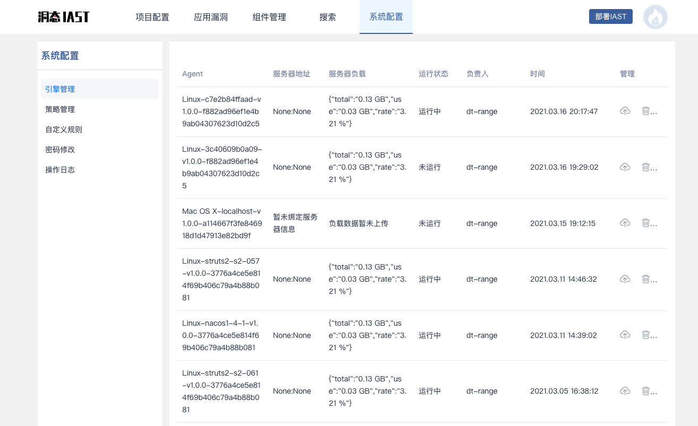
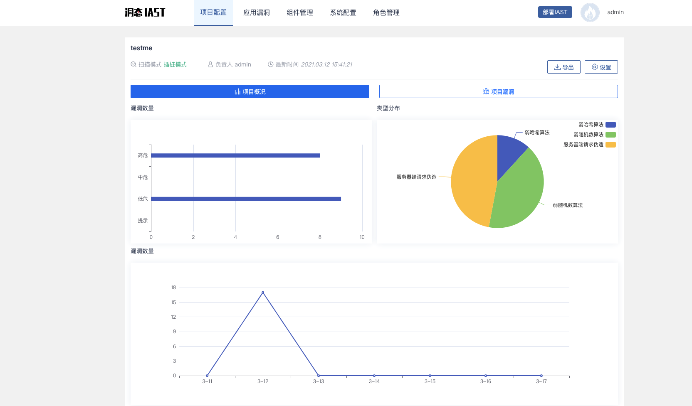

> 灵芝IAST升级为”火线～洞态IAST“，同时，提供独立的SaaS版本，支持第三方组件管理、通用漏洞检测、越权漏洞检测、组件级漏洞挖掘

洞态IAST SaaS版本地址：[http://aws.iast.huoxian.cn:8000/login](http://aws.iast.huoxian.cn:8000/login)

#### 一、下载Agent
- 登陆[IAST平台](http://aws.iast.huoxian.cn:8000/login)
- 访问“部署IAST”功能
- 选择目标应用使用的**开发语言**(Java、PHP、Python、.Net等)
- 选择对应的操作系统和版本（JDK 1.8及以下选择1.8，JDK 1.8以上选择1.9）
- 进入下载、配置页面，根据步骤完成下载和配置

#### 二、配置agent并启动应用（以SpringBoot为例）
SpringBoot默认打为`jar`包，通过`java -jar app.jar`的方式启动；在这类SpringBoot上安装agent时，只需要在启动命令上增加一个参数即可：`java -javaagent:/path/to/agent.jar -jar app.jar`

应用启动后，可以在**系统配置**内**引擎管理**页面看到刚上线的agent

#### 三、创建项目并绑定agent
进入**项目配置**页面，创建项目并绑定第二步中注册的agent

#### 四、检测漏洞
项目创建完成后，即可正常访问应用，触发API检测漏洞；检测到的漏洞可以在**项目详情**页面中看到，也可以在**应用漏洞**页面看到。

