> 灵芝IAST升级为”火线～洞态IAST“，同时，提供独立的SaaS版本，支持第三方组件管理、通用漏洞检测、越权漏洞检测、组件级漏洞挖掘

洞态IAST SaaS版本地址：[https://iast.huoxian.cn/login](https://iast.huoxian.cn/login) 

### 一、注册登录

#### 1.注册

- 填写 [调查问卷](https://wj.qq.com/s2/8269653/6ff2/) 进行注册
    
  
  **注意**：账号统一在每天上午10点创建

- 提交成功之后生成用户，我们会将用户名和密码发送至您的邮箱，请注意查收

#### 2.登录

- 火线-洞态IAST地址：https://iast.huoxian.cn
  
  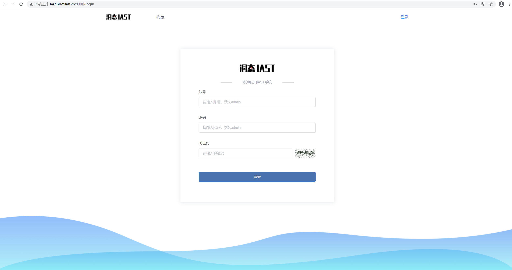


#### 3.修改密码

- 登录 [IAST平台](https://iast.huoxian.cn/login) 后，点击系统配置，在左边栏中选择密码修改，即可修改密码

  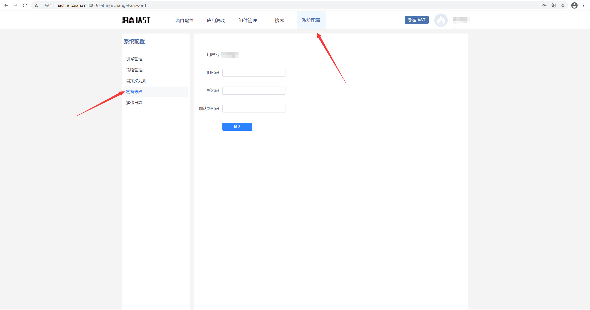


### 二、使用在线靶场快速体验IAST

目前在线靶场提供了openrasp测试环境、BenchMark测试环境等，可通过在线靶场快速启动云端环境体验 IAST的使用流程，下文以靶场镜像 openrasp的靶场环境为例进行演示。

#### 1.在线靶场配置 IAST token

- 登陆[IAST平台](https://iast.huoxian.cn/login)
- 访问“部署IAST”功能
- 选择目标应用使用的**开发语言**(Java)
- 选择对应的操作系统和版本（JDK 1.8及以下选择1.8，JDK 1.8以上选择1.9）
- 复制 TOKEN 

  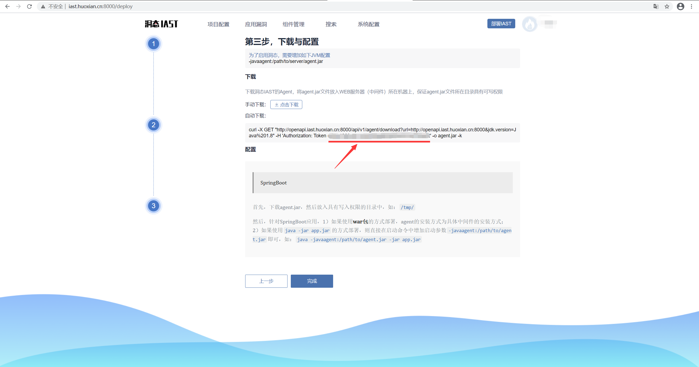

- 登陆[靶场](https://labs.iast.huoxian.cn) ，靶场账号与 IAST 账号相同
- 点击系统设置，进入token配置页面，粘贴之前复制的token后，点击修改即可保存

  


#### 2.下载靶场镜像（以镜像 openrasp1-3-6 为例）

- 以镜像 openrasp1-3-6 为例，点击镜像管理，在对应镜像后点击下载，弹出提示框，开始下载靶场

  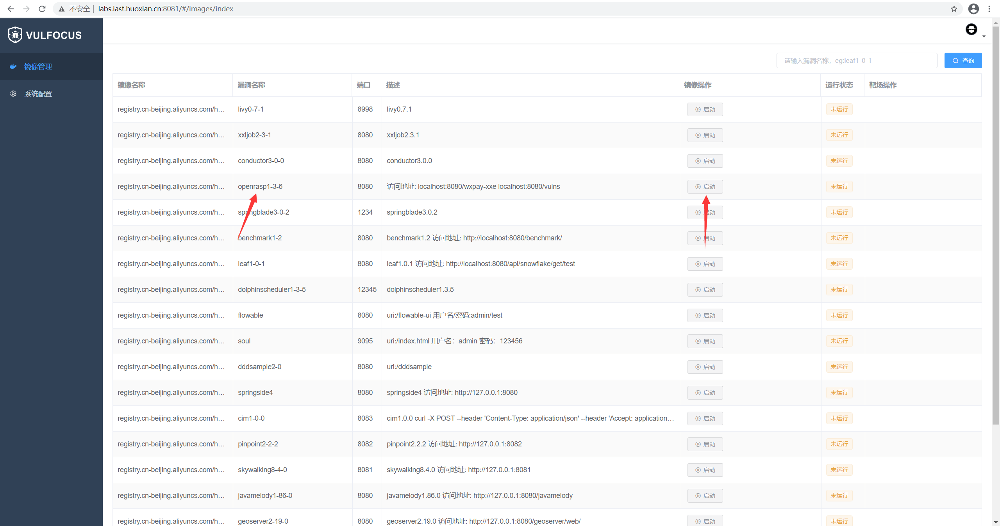

- 下载成功后，查看当前靶场描述项是否有访问路径（例如 openrasp1-3-6 的访问路径为 /wxpay-xxe 和 /vulns），如果有请复制，点击进入靶场，将访问路径粘贴即可访问项目

  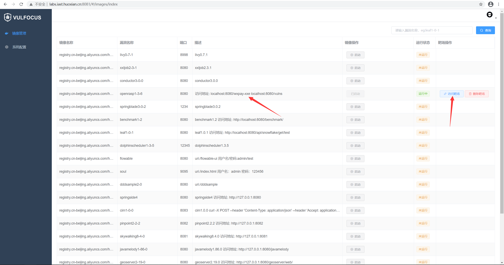

  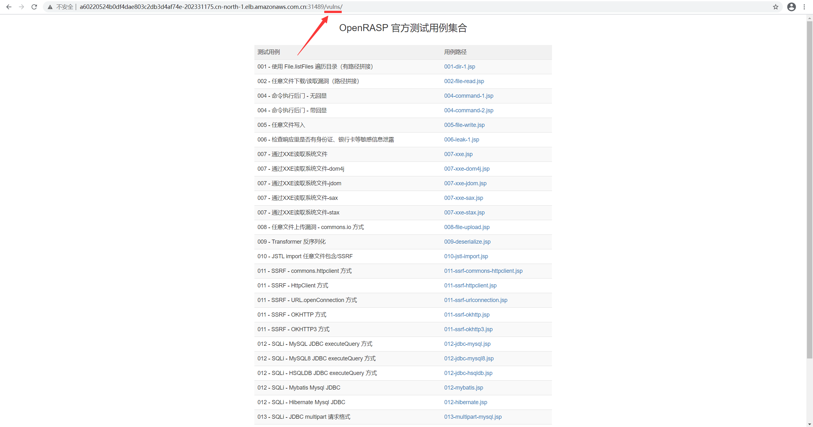

- 项目启动成功后进入[IAST平台](https://iast.huoxian.cn/login) ，可以在系统配置内引擎管理页面看到刚上线的应用
  
  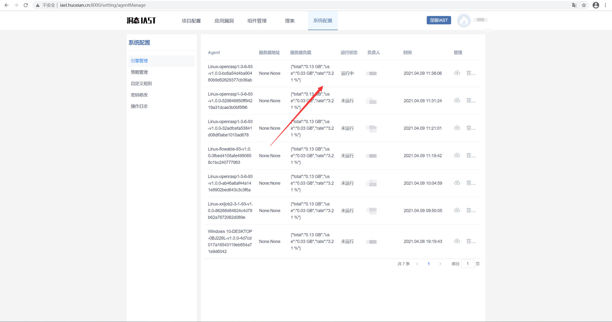

#### 3、创建项目
- 进入**项目配置**页面，点击**新建项目**

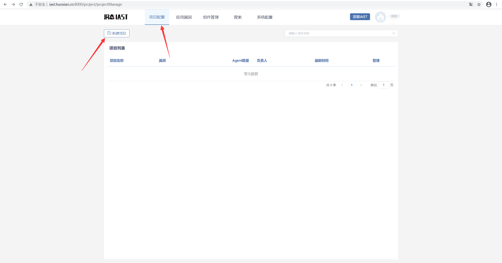
  
- 新建项目，填写基本设置后保存


#### 4、检测漏洞
项目创建完成后，即可正常访问应用，触发API检测漏洞；检测到的漏洞可以在**项目详情**页面中看到，也可以在**应用漏洞**页面看到。

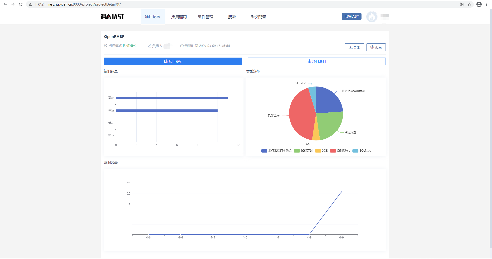


### 三、使用本地应用程序安装 IAST
#### 1、下载Agent
- 登陆[IAST平台](https://iast.huoxian.cn/login)
- 访问“部署IAST”功能
- 选择目标应用使用的**开发语言**(Java)
- 选择对应的操作系统和版本（JDK 1.8及以下选择1.8，JDK 1.8以上选择1.9）
- 进入下载、配置页面，根据步骤完成下载和配置


#### 2、配置agent并启动应用（以SpringBoot为例）
SpringBoot默认打为`jar`包，通过`java -jar app.jar`的方式启动；在这类SpringBoot上安装agent时，只需要在启动命令上增加一个参数即可：

```shell
java -javaagent:/path/to/agent.jar -Dproject.name=<project name> -jar app.jar
```
注意：`-Dproject.name=<project name>` 为可选参数，`<project name>`与创建的项目名称保持一致，agent将自动关联至项目；如果不配置该参数，需要进入项目管理中进行手工绑定。


应用启动后，可以在**系统配置**内**引擎管理**页面看到刚上线的agent，若没有指定`-Dproject.name=<project name>`，项目名称默认为`Demo Project`。

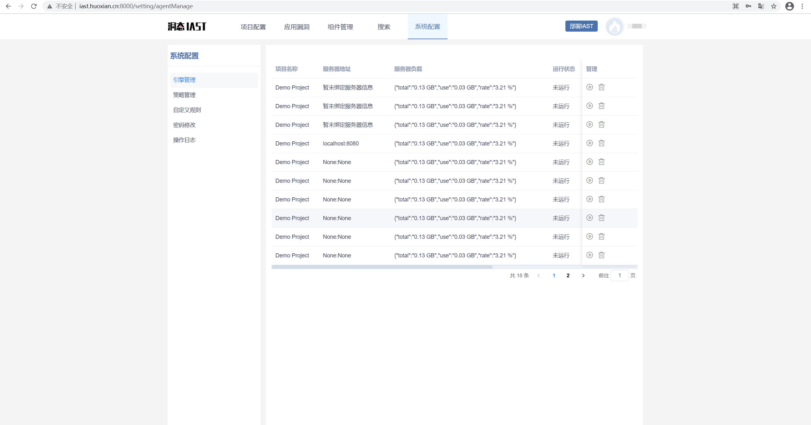

#### 3、创建项目

进入**项目配置**页面，若使用`-Dproject.name=<project name>`参数，agent会自动关联至此。若要关联其他agent，可在设置中自主配置。


#### 4、检测漏洞
项目创建完成后，即可正常访问应用，触发API检测漏洞；检测到的漏洞可以在**项目详情**页面中看到，也可以在**应用漏洞**页面看到。


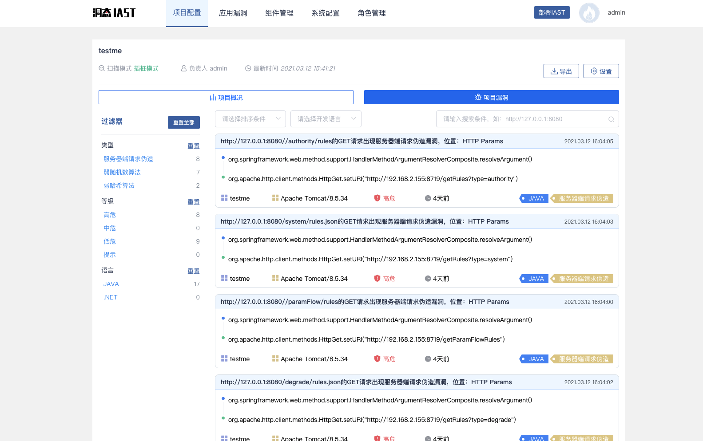